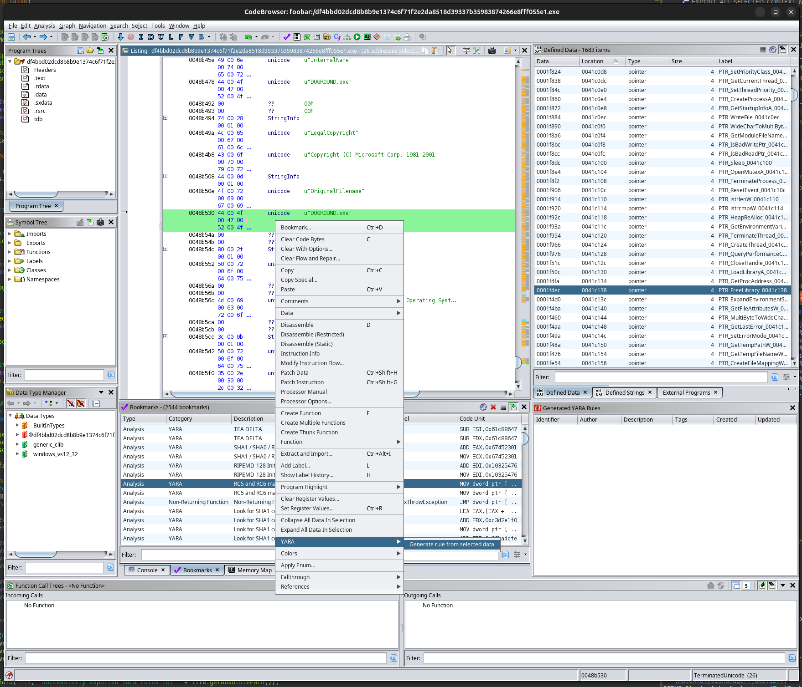

# Ghidra_YARA



## Introduction

This is an extension providing an Analyzer for Ghidra integrating the YARA engine (via `yara-java`
bindings) directly in the analysis process.

Until now, Ghidra users interested in leveraging YARA signature detection needed to resort to
scripting or out-of-band solutions. With this extension, the entire process can be configured per-program
and executed within the existent analysis workflow, automatically or manually, making the YARA
engine a first-class citizen in the process.

**This extension is still in development.** It is fully functional, but should be considered
experimental.

## Highlights

 - Can operate in monolithic or block-based scanning mode: the former loads the entirety of the program in contiguous memory (coalescing the initialized memory blocks), while the latter will iterate through each block independently.
 - High performance: typical sub-second completion times even with dozens of thousands of non-optimized rules loaded.
 - Can load external user-provided rules, refreshed each time the analyzer is tasked.
 - Provides excellent detection capabilities for:
     - Algorithmic (ex. CRC) and cryptographic constants using a modernized version of the `signsrch` ruleset, among others.
     - Packers (via rules translated from PEID and other sources).
 - Fully integrated in the analysis workflow.
 - Automatic labeling and creation (avoiding conflicts) of data types matching the exact size of the detected signature.
     - For example, CRC lookup tables can be fully recovered, labeled and typed correctly.

## Curated rule sets

Currently, we provide a limited set of rules, documented in the `data/rules` directory. Some of
these have been modified to eliminate false positives and otherwise irrelevant rules that, in our
experience, are not particularly useful in a reverse engineering context.

The importance of minimizing or crafting rules carefully cannot be overstated: typically, the use
case for YARA inside a tool like a Ghidra will be matching constants, such as those belonging to
cryptographic suites, or algorithms related to error correction, lookup tables, encoding, etc.
Function detection, for example, is best left to other Ghidra components to deal with (such as the
FID engine). For example, YARA rules intended to match strings related to "antivm" or "antidebug",
as found in many public repositories, are practically useless, and usually create conflicts. This
also applies to rules attempting to detect compiler toolchains (as opposed to, say, packers).

Examples of good targets for rules to use with Ghidra:
 
 - URLs, API tokens, and other potential *secrets*.
 - S-Boxes, initialization vectors and constants, multiplication constants.
 - Error correction tables.
 - Codec-specific tables, transformations, etc.
 - Telltale marks from known APT samples and their components, including variants of known ciphers.
 - Shellcode stages.
 - Packet and network protocol headers that could be used as part of covert channels or C2 routines.

TL;DR: Let the disassembler and decompiler do what they do best, and let the YARA engine do what it does best.


## Reporting bugs

Please file an issue, or even better, provide a **tested** and **documented** PR. :-)

## Licensing

```
   Copyright (c) 2024 Subreption LLC. All rights reserved.
   Copyright (c) 2015-2022 Paul Apostolescu. All rights reserved.

   Licensed under the Apache License, Version 2.0 (the "License");
   you may not use this file except in compliance with the License.
   You may obtain a copy of the License at

       http://www.apache.org/licenses/LICENSE-2.0

   Unless required by applicable law or agreed to in writing, software
   distributed under the License is distributed on an "AS IS" BASIS,
   WITHOUT WARRANTIES OR CONDITIONS OF ANY KIND, either express or implied.
   See the License for the specific language governing permissions and
   limitations under the License.
```

This library and source code are distributed under the terms described in the `LICENSE` file.
